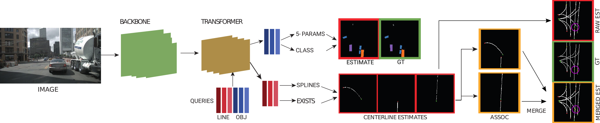
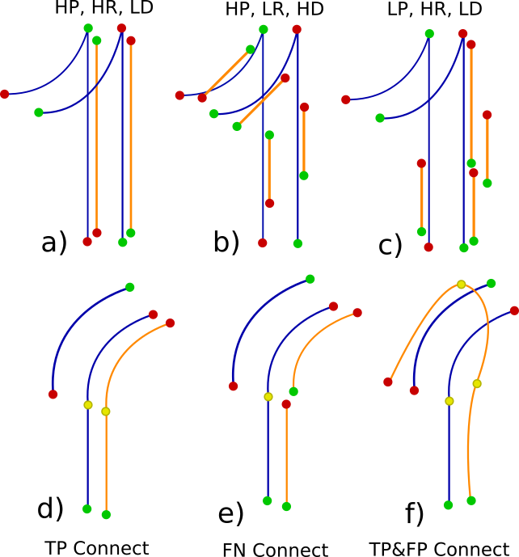

Official code for "Structured Bird’s-Eye-View Traffic Scene Understanding from Onboard Images"

[Link to paper](https://arxiv.org/pdf/2110.01997.pdf)

We provide support for Nuscenes and Argoverse datasets. 

## Steps
0. Make sure you have installed Nuscenes and/or Argoverse devkits and datasets installed
1. In configs/deafults.yml file, set the paths
2. Run the make_labels.py file for the dataset you want to use
3. If you want to use zoom augmentation (only for Nuscenes currently), run src/data/nuscenes/sampling_grid_maker.py (Set the path to save the .npy file in the sampling_grid_maker.py)
4. You can use train_tr.py for training the transformer based model or train_prnn.py to train the Polygon-RNN based model
5. We recommend using the Cityscapes pretrained Deeplab model (link provided below) as backbone for training your own model
6. Validator files can be used for testing. The link to trained models are given below.

## Trained Models

Cityscapes trained Deeplabv3 model is at:  https://data.vision.ee.ethz.ch/cany/STSU/deeplab.pth

Nuscenes trained Polygon-RNN based model is at:  https://data.vision.ee.ethz.ch/cany/STSU/prnn.pth

Nuscenes trained Transformer based model is at:  https://data.vision.ee.ethz.ch/cany/STSU/transformer.pth

## Metrics

The implementation of the metrics can be found in src/utils/confusion.py.
Please refer to the paper for explanations on the metrics.

### Additional Links

- Polygon-RNN: https://github.com/fidler-lab/polyrnn-pp
- DETR: https://github.com/facebookresearch/detr
- PINET: https://github.com/koyeongmin/PINet_new
- PON: https://github.com/tom-roddick/mono-semantic-maps
